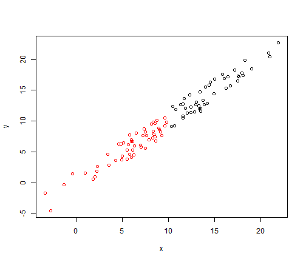

# A Changing World

*Italics and stuff*
[This is a link](http://scicomp2014.edc.uri.edu)


This is simply a template for the NRS592 Blog Posts.  

When you start you post all you need to do is:

1. Open the template file
2. Save this with the following naming convention: `YEAR-MO-DY-LastName.Rmd`
3. Edit the `YAML`.
4. Write your post
5. Save the `.Rmd` in postsRMarkdown
6. Commit changes (you can use the `Git` tab in RStudio).
7. Push those changes back up to your repository on GitHub.
8. Submit a pull request.

To make it a bit easier, here are some of the things mentioned on the first day of class.

This example with echo and evaluate.


```r
x <- rnorm(100, 10, 5)
y <- jitter(x, 1000)
z <- vector("character", 100)
z[x > 10] <- "High"
z[x < 10] <- "Low"
df <- data.frame(x, y, z)
df
```

```
##           x       y    z
## 1    6.8836  7.5762  Low
## 2    4.8762  3.0237  Low
## 3    7.0264  5.6218  Low
## 4    2.1089  4.1009  Low
## 5    7.9564  9.8934  Low
## 6    9.9483 11.7537  Low
## 7    6.7724  5.4867  Low
## 8    8.5231  9.4848  Low
## 9    9.5317  9.9460  Low
## 10  14.6558 12.7225 High
## 11  14.2258 15.8662 High
## 12  13.1742 14.9245 High
## 13   9.7633  9.9954  Low
## 14  10.9839 10.4015 High
## 15  14.2245 13.3209 High
## 16   5.9375  7.4022  Low
## 17   8.9604 10.7772  Low
## 18   7.5174  8.4925  Low
## 19   7.0766  9.0324  Low
## 20   9.6280 10.6338  Low
## 21  14.4924 16.4527 High
## 22  11.7302  9.9588 High
## 23   6.0061  5.3147  Low
## 24  17.2173 18.4982 High
## 25  15.9194 16.2861 High
## 26  10.6009  9.4416 High
## 27   8.4225  7.5989  Low
## 28  11.8820 12.1636 High
## 29   5.9087  4.0828  Low
## 30   0.6074  0.4391  Low
## 31   6.2407  5.7576  Low
## 32   8.9716  8.7527  Low
## 33  12.1706 12.7778 High
## 34  19.1441 17.2006 High
## 35   3.7851  4.4882  Low
## 36  12.1573 10.4596 High
## 37  12.8454 13.3516 High
## 38   8.9606  7.9326  Low
## 39   7.7324  6.2165  Low
## 40   9.0405  8.2719  Low
## 41   7.3419  9.2172  Low
## 42  13.6489 12.8738 High
## 43   8.4856  8.9096  Low
## 44  10.0732  9.6550 High
## 45  16.8054 14.9289 High
## 46   5.1932  4.6507  Low
## 47   8.1940  9.3210  Low
## 48   8.5440  9.0400  Low
## 49   4.3580  5.6034  Low
## 50   7.4105  8.9355  Low
## 51   9.6252  9.4662  Low
## 52  11.3247 12.8980 High
## 53   7.2087  5.4194  Low
## 54  12.8699 14.0874 High
## 55  11.5181 10.6374 High
## 56  20.6803 20.9000 High
## 57   7.8783  7.3453  Low
## 58  11.3307 13.1119 High
## 59  18.6494 17.3795 High
## 60   9.1137  7.6126  Low
## 61  15.4918 17.4598 High
## 62  22.7849 23.3846 High
## 63  14.6339 14.0270 High
## 64  12.8495 13.0726 High
## 65   4.0129  4.6040  Low
## 66   7.7044  5.7272  Low
## 67   9.2478  8.7078  Low
## 68   9.3595 10.4400  Low
## 69   8.7483  9.3661  Low
## 70   8.4770  7.0613  Low
## 71   8.9844  9.7452  Low
## 72  10.0902 11.8755 High
## 73   9.2306  7.9950  Low
## 74   8.3489  9.2671  Low
## 75   8.6512 10.0783  Low
## 76   7.5657  6.5852  Low
## 77  22.4853 20.9842 High
## 78  18.5254 19.9848 High
## 79  -0.9088 -1.5863  Low
## 80   4.3435  5.9153  Low
## 81   5.9285  6.5155  Low
## 82  15.2756 15.2153 High
## 83  10.3867 11.1495 High
## 84   8.1380  9.3770  Low
## 85   6.4277  6.1480  Low
## 86   9.3764  8.8981  Low
## 87   5.2106  5.4085  Low
## 88   6.9226  5.3809  Low
## 89   9.4360 10.2091  Low
## 90   8.9063  7.8783  Low
## 91   0.9667  1.4644  Low
## 92   3.8513  3.0765  Low
## 93   7.0075  5.8907  Low
## 94  -5.5997 -5.9775  Low
## 95  22.3332 22.2645 High
## 96   6.3478  8.2229  Low
## 97  20.3879 19.2487 High
## 98  10.6212 10.7791 High
## 99  10.3365 11.3893 High
## 100 10.2561  9.0688 High
```


And an example that just echo's the code without evaluation:


```r
# This is what a comment looks like
print("Some stuff to print (but not really, becuase this isn't evaluated!")
```


Here's a plot, without echoing :

 


And to get more on this, check out [the first class blog post](http://scicomp2014.edc.uri.edu/posts/2014-01-27-Hollister.html)

