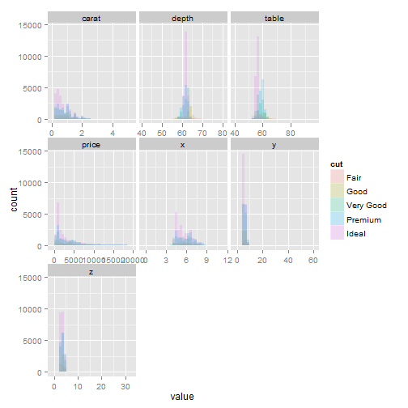

Perhaps as a first order of business, those linked successfully to Github can perform a pull to get this `.Rmd` file on your computer.  Then, we can walk through it together in `RStudio` with the expectation that the interactivity will aid retention.

So, if you want to follow along:

1. Open Git Bash
2. Navigate to the local repository for the Scientific Computing class
3. Perform the pull.  On my machine, it looks something like:  `git pull origin gh-pages`
4. Then you can open this file, `2014-03-03-Smith.Rmd`, in RStudio.

# Customizing R at startup

Annoyed by some of R's defaults (e.g., strings as factors, p-value stars)?  Tired of typing full function names of common functions (e.g., summary, head, etc.)?  Want to load commonly used packages automatically?  Have a suite of random functions you use all the time?  No problem.  R gives you several options to meet your needs.  

First, you can create a custom R profile that loads at startup.  This is simply a text file (called .Rprofile) placed in your home directory.  Don't know where your home directory is?  Start RStudio, close any open projects, and type `getwd()`. 

Consider the following (simple) Rprofile:

```r
# Feeling creative?  Customize the R interactive prompt
options(prompt = "aRRR> ")

# Change some R defaults
options(stringsAsFactors = FALSE, show.signif.stars = FALSE)

# Create a new invisible environment for functions so as not to clutter your
# workspace.
.env <- new.env()

# Some useful aliases
.env$s <- base::summary
.env$cd <- base::setwd
.env$pwd <- base::getwd

# Some useful functions

## Return names(df) in single column, numbered matrix format.
.env$n <- function(df) matrix(names(df))

## Head and tail; show the first and last 10 items of an object
.env$ht <- function(d) rbind(head(d, 10), tail(d, 10))

# This function runs when R starts
.First <- function() {
    toLoad = c("plyr", "lubridate", "reshape2", "ggplot2", "devtools")
    sapply(toLoad, require, character.only = TRUE)
    rm(toLoad)
    cat("\nBack for more, eh?\n")
}

# This function runs when R closes
.Last <- function() {
    cat("\nLeaving so soon?  You'll be back.  I know it.\n")
}
```


Inspiration for Rprofile modifications abound online (e.g., [here][custom1] and [here][custom2]).  Importantly, notice that we've included aliases and utility functions in a hidden environment.  This keeps our workspace clean and avoids their accidental removal.  

While a custom Rprofile generally works well, you may run into problems when sharing scripts with colleagues if they operate R with different defaults.  A more reproducible approach is to keep your customizations in a version-controlled script on, e.g., [Github][github] and source it at the beginning of every script.  Your collaborators then have access to it as well.  For example, assuming the `devtools` package is loaded, ypu can call in an custom script saved as a [gist][gist] using `source_gist`.  Voila!  Here's how I load my [R profile][myprofile]:


```r
source_gist(9216051, quiet = TRUE)
```

```
## SHA-1 hash of file is 88c05eb67d371880b7c774e32eb495cb9c22f16a
```


One final alternative, but beyond our scope, is to keep your functions in an R package (see, e.g., [here][packages]).

# Plotting, managing, sorting, reshaping, and cleaning data

OK, I'll admit it - `Rcmdr` houses a wider breadth of methods than I recalled (or expected).  But you'll have to throw away the training wheels (i.e., GUI) at some point.  You can only hide from the console for so long.  Data reorganization, reshaping, and cleaning are a set of common tasks for which this is likely to be the case, and one for which R is very capable.  Moreover, it's good practice to bring your raw data into R *before* you perform any manipulations or analysis.  Not only is R very capable of these manipulations, but coding them in R makes the manipulations transparent and reproducible; the same can't be said of button clicks in Excel. 

We'll skip getting data into R and instead focus on some useful data manipulation functions.  Jeff covered this in [bootcamp][bootcamp].  But, to summarize your data input options, R can handle nearly any data format including `.csv`, `.sas`, `.spss`, and even `.xls` and `.xlsx` if you're patient.  To summarize the summary: make `.csv` (Excel can output these easily) and the `read.csv` command your friends.  

## Plotting raw data

Looking at your raw data before analysis is tremendously important.  I hesitate to skip it, but we could spend an entire semester on the many ways R gives you to look at your raw data.  On the other hand, there is lots of useful guidance online for both base graphics and `gglot2` (e.g., [here][uclaplots] and [here][ggplot2]).  The `lattice` package is another viable option.  In the interest of time, we'll simply refer you to those links and the [Getting help](#help) section below.

## Sorting by one or more columns

R likewise gives you many options to perform common data sorting and manipulation tasks.  We'll focus on some of the more intuitive convenience functions to perform these tasks.  Most of them reside in Hadley Wickham's `plyr` and `reshape2` packages. 

We'll use the `diamonds` data set in the `ggplot2` package.  `diamonds` is a large (50000+) data set with multiple numeric and categorical variables.  


```r
# Look at the description of the diamonds data
`?`(diamonds)
```

```
## starting httpd help server ... done
```

```r
str(diamonds)
```

```
## 'data.frame':	53940 obs. of  10 variables:
##  $ carat  : num  0.23 0.21 0.23 0.29 0.31 0.24 0.24 0.26 0.22 0.23 ...
##  $ cut    : Ord.factor w/ 5 levels "Fair"<"Good"<..: 5 4 2 4 2 3 3 3 1 3 ...
##  $ color  : Ord.factor w/ 7 levels "D"<"E"<"F"<"G"<..: 2 2 2 6 7 7 6 5 2 5 ...
##  $ clarity: Ord.factor w/ 8 levels "I1"<"SI2"<"SI1"<..: 2 3 5 4 2 6 7 3 4 5 ...
##  $ depth  : num  61.5 59.8 56.9 62.4 63.3 62.8 62.3 61.9 65.1 59.4 ...
##  $ table  : num  55 61 65 58 58 57 57 55 61 61 ...
##  $ price  : int  326 326 327 334 335 336 336 337 337 338 ...
##  $ x      : num  3.95 3.89 4.05 4.2 4.34 3.94 3.95 4.07 3.87 4 ...
##  $ y      : num  3.98 3.84 4.07 4.23 4.35 3.96 3.98 4.11 3.78 4.05 ...
##  $ z      : num  2.43 2.31 2.31 2.63 2.75 2.48 2.47 2.53 2.49 2.39 ...
```

```r
head(diamonds, 10)
```

```
##    carat       cut color clarity depth table price    x    y    z
## 1   0.23     Ideal     E     SI2  61.5    55   326 3.95 3.98 2.43
## 2   0.21   Premium     E     SI1  59.8    61   326 3.89 3.84 2.31
## 3   0.23      Good     E     VS1  56.9    65   327 4.05 4.07 2.31
## 4   0.29   Premium     I     VS2  62.4    58   334 4.20 4.23 2.63
## 5   0.31      Good     J     SI2  63.3    58   335 4.34 4.35 2.75
## 6   0.24 Very Good     J    VVS2  62.8    57   336 3.94 3.96 2.48
## 7   0.24 Very Good     I    VVS1  62.3    57   336 3.95 3.98 2.47
## 8   0.26 Very Good     H     SI1  61.9    55   337 4.07 4.11 2.53
## 9   0.22      Fair     E     VS2  65.1    61   337 3.87 3.78 2.49
## 10  0.23 Very Good     H     VS1  59.4    61   338 4.00 4.05 2.39
```

```r
summary(diamonds)  # notice no missing values (NAs); very uncommon
```

```
##      carat              cut        color        clarity          depth     
##  Min.   :0.200   Fair     : 1610   D: 6775   SI1    :13065   Min.   :43.0  
##  1st Qu.:0.400   Good     : 4906   E: 9797   VS2    :12258   1st Qu.:61.0  
##  Median :0.700   Very Good:12082   F: 9542   SI2    : 9194   Median :61.8  
##  Mean   :0.798   Premium  :13791   G:11292   VS1    : 8171   Mean   :61.8  
##  3rd Qu.:1.040   Ideal    :21551   H: 8304   VVS2   : 5066   3rd Qu.:62.5  
##  Max.   :5.010                     I: 5422   VVS1   : 3655   Max.   :79.0  
##                                    J: 2808   (Other): 2531                 
##      table          price             x               y               z        
##  Min.   :43.0   Min.   :  326   Min.   : 0.00   Min.   : 0.00   Min.   : 0.00  
##  1st Qu.:56.0   1st Qu.:  950   1st Qu.: 4.71   1st Qu.: 4.72   1st Qu.: 2.91  
##  Median :57.0   Median : 2401   Median : 5.70   Median : 5.71   Median : 3.53  
##  Mean   :57.5   Mean   : 3933   Mean   : 5.73   Mean   : 5.73   Mean   : 3.54  
##  3rd Qu.:59.0   3rd Qu.: 5324   3rd Qu.: 6.54   3rd Qu.: 6.54   3rd Qu.: 4.04  
##  Max.   :95.0   Max.   :18823   Max.   :10.74   Max.   :58.90   Max.   :31.80  
## 
```


Notice that this data set is in wide format.  That is, each of our units of observation (each diamond, in this case) is associated with multiple columns representing several measured variable.  The alternative, long format, puts each variable on its own line, in which case each observation (diamond) would be associated with multiple rows.  Most analyses in R require data in the wide format, but long format is useful in certain situations.  We'll come back to the utility of the long format later.

Let's start with simple operations.  One of the most basic data frame manipulations is sorting by one or more columns.  In base R, the `order` function is the function of choice, but its syntax is a bit painful.  For example, to sort the diamond data by increasing size (carat) and decreasing price:


```r
dsort <- diamonds[with(diamonds, order(carat, -price)), ]
# dsort <- diamonds[order(diamonds$carat, -diamonds$price), ] # equivalent sort
head(dsort, 10)
```

```
##       carat       cut color clarity depth table price    x    y    z
## 31592   0.2   Premium     E     VS2  59.8    62   367 3.79 3.77 2.26
## 31593   0.2   Premium     E     VS2  59.0    60   367 3.81 3.78 2.24
## 31594   0.2   Premium     E     VS2  61.1    59   367 3.81 3.78 2.32
## 31595   0.2   Premium     E     VS2  59.7    62   367 3.84 3.80 2.28
## 31596   0.2     Ideal     E     VS2  59.7    55   367 3.86 3.84 2.30
## 31597   0.2   Premium     F     VS2  62.6    59   367 3.73 3.71 2.33
## 31598   0.2     Ideal     D     VS2  61.5    57   367 3.81 3.77 2.33
## 31599   0.2 Very Good     E     VS2  63.4    59   367 3.74 3.71 2.36
## 31600   0.2     Ideal     E     VS2  62.2    57   367 3.76 3.73 2.33
## 31601   0.2   Premium     D     VS2  62.3    60   367 3.73 3.68 2.31
```


Yikes.  That's pretty ugly.  The `arrange` function in `plyr` makes it far more intuitive, and should take care of your sorting needs.


```r
dsort2 <- arrange(diamonds, carat, -price)
head(dsort2, 10)
```

```
##    carat       cut color clarity depth table price    x    y    z
## 1    0.2   Premium     E     VS2  59.8    62   367 3.79 3.77 2.26
## 2    0.2   Premium     E     VS2  59.0    60   367 3.81 3.78 2.24
## 3    0.2   Premium     E     VS2  61.1    59   367 3.81 3.78 2.32
## 4    0.2   Premium     E     VS2  59.7    62   367 3.84 3.80 2.28
## 5    0.2     Ideal     E     VS2  59.7    55   367 3.86 3.84 2.30
## 6    0.2   Premium     F     VS2  62.6    59   367 3.73 3.71 2.33
## 7    0.2     Ideal     D     VS2  61.5    57   367 3.81 3.77 2.33
## 8    0.2 Very Good     E     VS2  63.4    59   367 3.74 3.71 2.36
## 9    0.2     Ideal     E     VS2  62.2    57   367 3.76 3.73 2.33
## 10   0.2   Premium     D     VS2  62.3    60   367 3.73 3.68 2.31
```


## Calculating new variables from existing columns

In many analyses, variables of interest derive from modifications or combinations of raw measurements.  R again gives you multiple options to create and calculate new variables from existing columns.  We'll look at two - base R's `within` function and `plyr`'s `mutate` function.


```r
# Creating two new variables:
# 1. logP: natural log of diamond price
# 2. volume: silly estimate of diamond volume (mm<sup>3</sup>)

# First, use base R 'within' function
d <- within(diamonds, {
  logP <- log(price) # no comma here; compare 'mutate'
  volume <- x * y * z
  })
head(d)
```

```
##   carat       cut color clarity depth table price    x    y    z volume  logP
## 1  0.23     Ideal     E     SI2  61.5    55   326 3.95 3.98 2.43  38.20 5.787
## 2  0.21   Premium     E     SI1  59.8    61   326 3.89 3.84 2.31  34.51 5.787
## 3  0.23      Good     E     VS1  56.9    65   327 4.05 4.07 2.31  38.08 5.790
## 4  0.29   Premium     I     VS2  62.4    58   334 4.20 4.23 2.63  46.72 5.811
## 5  0.31      Good     J     SI2  63.3    58   335 4.34 4.35 2.75  51.92 5.814
## 6  0.24 Very Good     J    VVS2  62.8    57   336 3.94 3.96 2.48  38.69 5.817
```

```r
  
# Now use plyr 'mutate' function
d2 <- mutate(diamonds,
             logP = log(price), # comma here
             volume = x * y * z
              )
head(d2)
```

```
##   carat       cut color clarity depth table price    x    y    z  logP volume
## 1  0.23     Ideal     E     SI2  61.5    55   326 3.95 3.98 2.43 5.787  38.20
## 2  0.21   Premium     E     SI1  59.8    61   326 3.89 3.84 2.31 5.787  34.51
## 3  0.23      Good     E     VS1  56.9    65   327 4.05 4.07 2.31 5.790  38.08
## 4  0.29   Premium     I     VS2  62.4    58   334 4.20 4.23 2.63 5.811  46.72
## 5  0.31      Good     J     SI2  63.3    58   335 4.34 4.35 2.75 5.814  51.92
## 6  0.24 Very Good     J    VVS2  62.8    57   336 3.94 3.96 2.48 5.817  38.69
```


## Data aggregation and cross tabulation (i.e., 'pivot tables')

Typically, our data sets comprise a mixture of categorical (factor) and numeric variables.   Functions applied to the different levels of one or more of these factor variables (e.g., calculating group averages) is often a useful aspect of data exploration.
 
`plyr` contains functions that allow users to evaluate functions over one or more grouping variables (i.e., the levels of a categorical variable).  The `ddply` function simplifies this process.  The `dd` simply indicates that the function takes a data frame as an input and outputs a data frame.  There are other versions (e.g., `ldply`, which takes a list as an input and outputs a data frame), but `ddply` is the one you'll use most regularly.  

An example will hopefully clarify.  To calculate the average size (carats) for each combination of diamond cut, clarity, and color:  


```r
# First, what inputs does the function require?
?ddply

# How many groups are we talking about here?
with(diamonds, length(levels(cut)) * length(levels(clarity)) * length(levels(color)))
```

```
## [1] 280
```

```r

# Now, create a new data frame that takes the diamond data and calculates mean carat size by cut, clarity, and color combinations
dcut <- ddply(diamonds, .(cut, clarity, color), summarize,
              meancarat = mean(carat, na.rm = TRUE), # Don't need na.rm in this case, but often will
              ndiamonds = length(carat)) # # diamonds in each calculation
head(dcut, 10)
```

```
##     cut clarity color meancarat ndiamonds
## 1  Fair      I1     D    1.8775         4
## 2  Fair      I1     E    0.9689         9
## 3  Fair      I1     F    1.0234        35
## 4  Fair      I1     G    1.2264        53
## 5  Fair      I1     H    1.4987        52
## 6  Fair      I1     I    1.3229        34
## 7  Fair      I1     J    1.9935        23
## 8  Fair     SI2     D    1.0170        56
## 9  Fair     SI2     E    1.0156        78
## 10 Fair     SI2     F    1.0801        89
```

```r

# Note that any function can be applied over the grouping variable(s)
dcut2 <- ddply(diamonds, .(cut, clarity, color), summarize,
                    sdcarat = sd(carat, na.rm = TRUE),
                    nonsense = sqrt(median(x * y / z, na.rm = TRUE)))
```


A cross-tabulation (~ pivot table) with the `xtab` function can make `ddply`'s output a little easier on the eyes.  With three or more grouping variables, flattening the cross-tabulation with `ftable` may keep your head from exploding.


```r
# Two grouping variable example
xtabs(meancarat ~ cut + clarity, data = dcut)
```

```
##            clarity
## cut            I1   SI2   SI1   VS2   VS1  VVS2  VVS1    IF
##   Fair      9.911 8.567 6.956 6.293 6.058 5.179 4.995 1.390
##   Good      8.554 7.748 6.125 6.132 5.329 4.520 4.062 4.497
##   Very Good 9.237 7.776 6.188 5.950 5.305 4.512 3.734 4.368
##   Premium   9.149 8.361 6.665 6.230 5.746 4.954 4.299 4.687
##   Ideal     9.038 7.440 5.904 5.198 4.889 4.344 3.525 3.443
```

```r

# The order determines the arrangement of the table
xtabs(meancarat ~ clarity + cut, data = dcut)
```

```
##        cut
## clarity  Fair  Good Very Good Premium Ideal
##    I1   9.911 8.554     9.237   9.149 9.038
##    SI2  8.567 7.748     7.776   8.361 7.440
##    SI1  6.956 6.125     6.188   6.665 5.904
##    VS2  6.293 6.132     5.950   6.230 5.198
##    VS1  6.058 5.329     5.305   5.746 4.889
##    VVS2 5.179 4.520     4.512   4.954 4.344
##    VVS1 4.995 4.062     3.734   4.299 3.525
##    IF   1.390 4.497     4.368   4.687 3.443
```

```r

# Three grouping variables without flattening...  Not run...  xtabs(meancarat ~
# cut + clarity + color, data = dcut)

# Try it if you dare, but it's a bit painful to read.  Flattening helps.
ftable(xtabs(meancarat ~ cut + clarity + color, data = dcut))
```

```
##                   color      D      E      F      G      H      I      J
## cut       clarity                                                       
## Fair      I1            1.8775 0.9689 1.0234 1.2264 1.4987 1.3229 1.9935
##           SI2           1.0170 1.0156 1.0801 1.2620 1.3644 1.5116 1.3167
##           SI1           0.9138 0.8671 0.8641 0.9096 1.1123 1.1080 1.1811
##           VS2           0.8436 0.6902 0.7587 0.9778 1.0368 0.9531 1.0326
##           VS1           0.6300 0.6329 0.8048 0.7742 0.9759 1.0104 1.2294
##           VVS2          0.5911 0.6008 0.6270 0.6647 0.8409 0.8450 1.0100
##           VVS1          0.6067 0.6400 0.6680 0.5700 0.9100 0.9000 0.7000
##           IF            0.3800 0.0000 0.5550 0.4550 0.0000 0.0000 0.0000
## Good      I1            1.0400 1.3309 0.9763 1.1742 1.2521 1.4100 1.3700
##           SI2           0.8583 0.8826 1.0025 1.0869 1.1735 1.4248 1.3189
##           SI1           0.7008 0.7239 0.7683 0.8838 0.9067 1.0153 1.1258
##           VS2           0.7025 0.7394 0.7521 0.8157 0.8780 1.1296 1.1143
##           VS1           0.6633 0.6807 0.6246 0.7792 0.7799 0.9266 0.8750
##           VVS2          0.4812 0.5602 0.6076 0.6261 0.5884 0.7196 0.9369
##           VVS1          0.4908 0.4181 0.4657 0.5471 0.4735 0.6664 1.0000
##           IF            0.7867 0.3733 0.5333 0.6482 0.9350 0.5300 0.6900
## Very Good I1            0.9500 1.0695 1.2108 1.1238 1.6542 1.7663 1.4625
##           SI2           0.9317 0.9304 0.9512 1.0328 1.2346 1.3343 1.3609
##           SI1           0.7078 0.7231 0.7965 0.7858 0.9740 1.0659 1.1353
##           VS2           0.6337 0.6644 0.7420 0.8103 0.8932 1.0664 1.1405
##           VS1           0.5834 0.6098 0.6881 0.7013 0.7723 0.9854 0.9649
##           VVS2          0.4657 0.4267 0.5714 0.6507 0.5937 0.7018 1.1021
##           VVS1          0.4746 0.4001 0.4937 0.5247 0.5043 0.5709 0.7653
##           IF            0.8030 0.5793 0.6069 0.6004 0.5583 0.7647 0.4550
## Premium   I1            1.1550 1.0430 1.1353 1.2913 1.3398 1.6058 1.5785
##           SI2           0.9189 0.9577 1.0352 1.1427 1.3283 1.4240 1.5545
##           SI1           0.6917 0.7263 0.8421 0.8827 1.0840 1.1804 1.2578
##           VS2           0.5846 0.6189 0.7310 0.8095 1.0046 1.2359 1.2457
##           VS1           0.6871 0.6432 0.7673 0.7502 0.7796 0.9826 1.1362
##           VVS2          0.5805 0.5116 0.6576 0.6927 0.5775 0.6822 1.2521
##           VVS1          0.5383 0.4623 0.6062 0.5351 0.4163 0.5162 1.2246
##           IF            0.7080 0.5763 0.5255 0.5640 0.5980 0.5730 1.1417
## Ideal     I1            0.9600 1.0378 1.1079 1.1687 1.4755 1.2982 1.9900
##           SI2           0.7503 0.8744 0.9322 0.9761 1.1438 1.3785 1.3845
##           SI1           0.5948 0.6706 0.7696 0.7603 0.9372 1.0276 1.1439
##           VS2           0.4993 0.5211 0.6322 0.7697 0.7960 0.9279 1.0513
##           VS1           0.5335 0.5036 0.6440 0.7171 0.7065 0.8061 0.9784
##           VVS2          0.5448 0.4839 0.5773 0.6461 0.5673 0.6538 0.8706
##           VVS1          0.4601 0.4265 0.4762 0.5391 0.4935 0.5513 0.5783
##           IF            0.6157 0.4577 0.4115 0.4547 0.4746 0.4515 0.5768
```


## Joining data frames

Combining multiple data frames based on shared variables is another common data management task.  The base R `merge` function will work, but we'll stick with the `plyr` version - `join`.  To keep it simple, we'll illustrate only basic `join` usage; check the documentation for other options (e.g., data frames with incomplete matching).


```r
`?`(join)

# Join two diamond data frames Three shared columns (cut, clarity, and color)
head(dcut)
```

```
##    cut clarity color meancarat ndiamonds
## 1 Fair      I1     D    1.8775         4
## 2 Fair      I1     E    0.9689         9
## 3 Fair      I1     F    1.0234        35
## 4 Fair      I1     G    1.2264        53
## 5 Fair      I1     H    1.4987        52
## 6 Fair      I1     I    1.3229        34
```

```r
head(dcut2)
```

```
##    cut clarity color sdcarat nonsense
## 1 Fair      I1     D  1.0690    3.351
## 2 Fair      I1     E  0.2070    3.121
## 3 Fair      I1     F  0.5525    2.972
## 4 Fair      I1     G  0.6381    3.081
## 5 Fair      I1     H  0.7340    3.228
## 6 Fair      I1     I  0.5025    3.185
```

```r

# Join by cut, clarity, and color combination
djoin <- join(dcut, dcut2, by = c("cut", "clarity", "color"))
head(djoin)
```

```
##    cut clarity color meancarat ndiamonds sdcarat nonsense
## 1 Fair      I1     D    1.8775         4  1.0690    3.351
## 2 Fair      I1     E    0.9689         9  0.2070    3.121
## 3 Fair      I1     F    1.0234        35  0.5525    2.972
## 4 Fair      I1     G    1.2264        53  0.6381    3.081
## 5 Fair      I1     H    1.4987        52  0.7340    3.228
## 6 Fair      I1     I    1.3229        34  0.5025    3.185
```


## Using `ddply` with `mutate` to create observation-level variables relevant to group values

Sometimes it may be relevant to construct a new variable for your data set relative to a group-level measure.  For example, the absolute price of a diamond may be less important than the price of that diamond relative to similar diamonds.  In these cases, you can use `ddply` with `mutate` rather than `summarize` to calculate these relative variables.


```r
# Notice that using 'mutate' preserves all other variables in the data frame;
# using 'summarize' would preserve only the newly-created variable and the
# grouping variable(s).
diamonds2 <- ddply(diamonds, .(cut, color, clarity), mutate, priceDev = price - mean(price, 
    na.rm = TRUE), priceRes = resid(lm(price ~ carat)))
head(diamonds2)
```

```
##   carat  cut color clarity depth table price    x    y    z priceDev priceRes
## 1  1.50 Fair     D      I1  64.7    62  5460 7.19 7.04 4.60    -1923    151.3
## 2  1.70 Fair     D      I1  64.7    56  5617 7.46 7.37 4.80    -1766   -790.7
## 3  3.40 Fair     D      I1  66.8    52 15964 9.42 9.34 6.27     8581    215.0
## 4  0.91 Fair     D      I1  66.2    57  2491 6.00 5.94 3.95    -4892    424.3
## 5  0.75 Fair     D     SI2  64.6    57  2848 5.74 5.72 3.70    -1507    706.0
## 6  0.90 Fair     D     SI2  66.9    57  2885 6.02 5.90 3.99    -1470   -500.5
```


`ddply` is quite useful and intuitive for variable creation and data manipulation, but it can be a bit slow when you're dealing with very large data frames (e.g., hundreds of thousands or millions of records).  Nonetheless, modifications are available to speed it up in these instances (e.g., [here][speedup]), and `plyr` functions can run in parallel on multiple core machines.  Finally, for R 3.0.2 or later, Hadley has created a new incarnation of `ddply`.  The `dplyr` package is even more intuitive, allows you to chain commands together in a logical order, and much, much faster.  Hopefully we can revisit `dplyr` later this semester.

## Converting from wide format to long format for, e.g., plotting

We've noted that most analyses require data in wide format with a single record (row) for each sample and multiple columns for the variables measured on/during that sample.  A reminder of what wide format data looks like:


```
##   carat       cut color clarity depth table price    x    y    z
## 1  0.23     Ideal     E     SI2  61.5    55   326 3.95 3.98 2.43
## 2  0.21   Premium     E     SI1  59.8    61   326 3.89 3.84 2.31
## 3  0.23      Good     E     VS1  56.9    65   327 4.05 4.07 2.31
## 4  0.29   Premium     I     VS2  62.4    58   334 4.20 4.23 2.63
## 5  0.31      Good     J     SI2  63.3    58   335 4.34 4.35 2.75
## 6  0.24 Very Good     J    VVS2  62.8    57   336 3.94 3.96 2.48
```


In some instances, however, it may be useful to convert wide format data into long format data.  For example, `ggplot2` is usually happier with data in long format.  The `melt` function in the `reshape2` package makes this process easy, although the base R `reshape` function can be useful in more complicated situations, but I've never had to use it.


```r
dmelt <- melt(diamonds, id.vars = c("cut", "clarity", "color"))
rbind(head(dmelt), tail(dmelt))
```

```
##              cut clarity color variable value
## 1          Ideal     SI2     E    carat  0.23
## 2        Premium     SI1     E    carat  0.21
## 3           Good     VS1     E    carat  0.23
## 4        Premium     VS2     I    carat  0.29
## 5           Good     SI2     J    carat  0.31
## 6      Very Good    VVS2     J    carat  0.24
## 377575   Premium     SI1     D        z  3.58
## 377576     Ideal     SI1     D        z  3.50
## 377577      Good     SI1     D        z  3.61
## 377578 Very Good     SI1     D        z  3.56
## 377579   Premium     SI2     H        z  3.74
## 377580     Ideal     SI2     D        z  3.64
```


With this particularly data set in long format, we can easily visualize certain aspects of the data in `ggplot2`.


```r
dplot <- ggplot(dmelt, aes(x = value, fill = cut)) + geom_histogram(alpha = 0.2, 
    position = "identity") + facet_wrap(~variable, scales = "free_x")
suppressMessages(print(dplot))  # Preventing binwidth messages
```

 


Additionally, `melt`ing the data provides an additional way to reshape the data (with the `dcast` function in `reshape2`) by applying functions to different groups of the data, but that functionality is largely, if not entirely, available in `ddply` and `dplyr`.  Not surprisingly, there are [many ways][skinacat] to tackle these problems using base R and other packages.

<a name="help"/>
# Getting help 

Invariably, you're going to run into problems (e.g., error messages, warnings).  This is true whether you're using R, SAS, SPSS, or whatever.  But there is lots of R help at your fingertips, and much of it is useful!  For example:

- `?function` will give you the help page of a function or data set (e.g., `?ddply`, `?mtcars`)
- `example(function)` asks R to run an example(s) of the function
- `??searchterm` will look for a search term in all packages on CRAN (e.g., `??split`)
- `RSiteSearch("search terms")` will search the R site for your search terms (e.g., `RSiteSearch("plyr reshape2"))
- `RSiteSearch("{search terms}")` will search for an exact phrase (e.g., `RSiteSearch("{linear mixed model}")`)
- rseek.org is the R Google
- Speak of the devil, copy your error message from the console and [Google](http://www.google.com) it with the relevant package name (e.g., "length(rows) == 1 is not TRUE" ddply)
- Search tags in [Stack Overflow](http://stackoverflow.com/) (e.g., [R] [plyr] [ddply])
- [StackExchange][SE]: like Stack Overflow but for statistics 
- [Crantastic][cranny]: search through packages on CRAN
- Our [resources][resources] page


[custom1]: http://stackoverflow.com/questions/1189759/expert-r-users-whats-in-your-rprofile
[custom2]: http://gettinggeneticsdone.blogspot.com.es/2013/07/customize-rprofile.html
[github]: http://www.github.com
[gist]: https://gist.github.com
[myprofile]: https://gist.github.com/adamdsmith/9216051
[packages]: http://rmflight.github.io/posts/2014/02/package_dev_documentation.html
[bootcamp]: https://github.com/iglpdc/2014-01-13-uri/blob/gh-pages/rLessons/Data.md
[uclaplots]: http://www.ats.ucla.edu/stat/r/gbe/default.htm
[ggplot2]: http://docs.ggplot2.org/current/
[speedup]: http://stackoverflow.com/questions/3685492/r-speeding-up-group-by-operations/3686241#3686241
[skinacat]: http://lamages.blogspot.com/2012/01/say-it-in-r-with-by-apply-and-friends.html
[SE]: http://stats.stackexchange.com
[cranny]: http://crantastic.org
[resources]: http://scicomp2014.edc.uri.edu/resources.html
